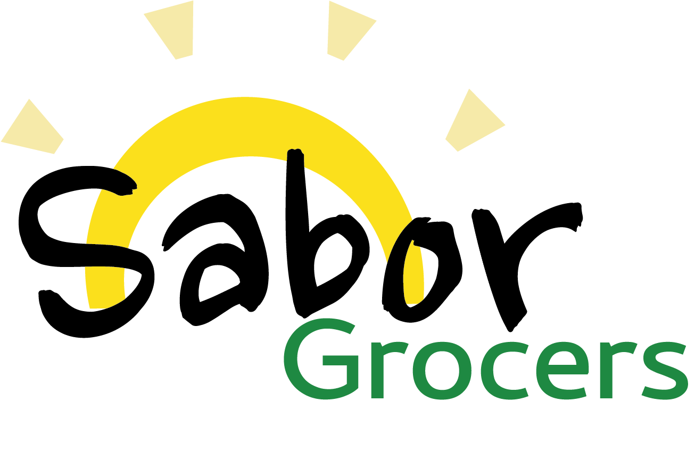
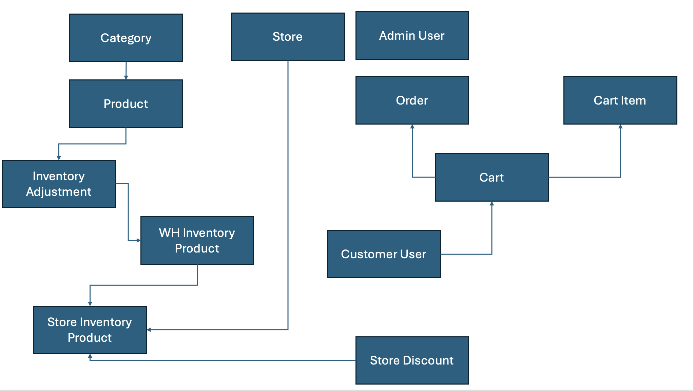
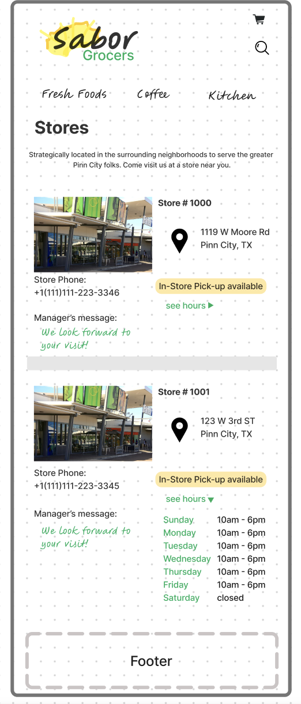
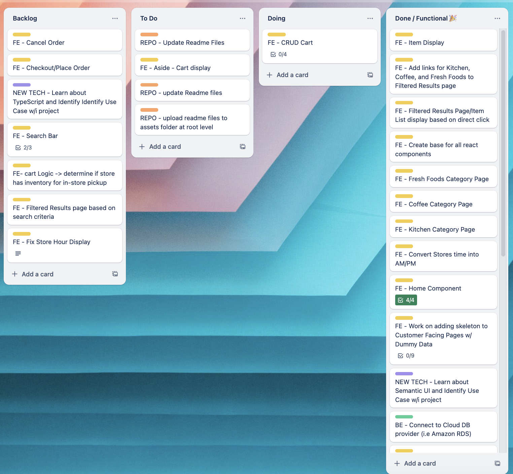

# Sabor Grocers

## Summary
Full stack application for niche fictional chain grocery stores that handles basic inventory management and order handling for e-commerce site.

## Table of Contents
- [Use Case](#usecase)
- [Technologies Used](#technologies-used)
- [Entity Relationship Diagram](#entity-relationship-diagram)
- [Component Hierarchy Diagram](#component-hierarchy-diagram)
- [Wireframes](#wireframes)
- [Site Layout](#site-layout)
- [Trello Board](#trello-board)
- [MVP/Stretch Goals](#mvpstretch-goals)

## Use Case
Growing retailer with multiple brick and mortar locations wants to enhance sales by providing customers with ability to order ahead to secure purchase commitment, create process improvements to offload inventory, and increase customer satisfaction.

## Technologies Used
#### Front End
- React
- Semantic UI
- JavaScript
- HTML
- CSS
#### Back end
- Python
- Django (w/ PostgreSQL)
- Hosted on Amazon RDS

## Entity Relationship Diagram

#### V2

#### V1
<kbd></kbd>
<kbd></kbd>
<kbd></kbd>

## Component Hierarchy Diagram
#### V2
[coming soon]

#### V1
<kbd></kbd>
<kbd></kbd>

## Wireframes

## Site Layout
[Coming soon]

## Trello Board
[Sabor Grocers Kanban Board](https://trello.com/b/gvykBecL/sabor-grocers)

<kbd>

## MVP/Stretch Goals

### MVP

_Features(guest/logged out user):_

- Access site pages (home, category pages, stores, filtered product list, product details)
- CRUD cart (initiate/create, view/read, edit/update, clear/delete)
- Mobile-first design, with similar experience on ~mobile, ~table, and ~desktop screen widths
  
### Stretch Goals
_Features(admin account):_

- CRUD Admin account (back end)
- CRUD Stores, Products, Categories, Discounts (applicable to specific product sku or category) (front and back end)
- Modify inventory items
- CRUD Admin account (front end)
- Read and/or cancel incoming orders (front end)
- CRUD Store Discounts (by product sku or by category)
- CRUD 'promo banner' feature
- CRUD 'inspiration'/'meal ideas' feature

_Features(logged in user):_

- Visit site pages
- See items filtered by category or searched query
- CRUD user account, cart
- Set cart items to 'in-store pickup' or 'delivery'
- Place order 
- Add capability to set cart items to 'deliver to store' for 'in-store pickup'
- Access order from account

_Features(guest):_

- Place order as guest
- Access order using order number
- See items filtered searched query
